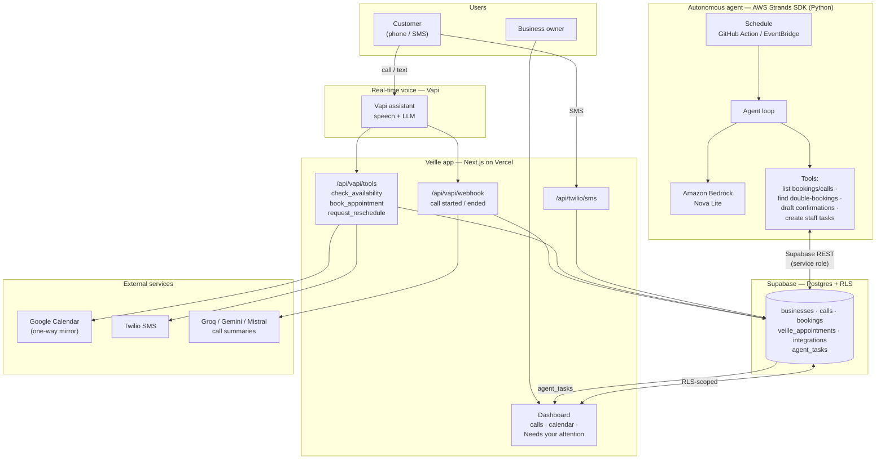

# Architecture

Veille is an after-hours AI receptionist. The **real-time voice** work is handled
by Vapi; the **Veille app** (Next.js) persists everything to Supabase; and the
**autonomous Strands agent** (this repo) runs in the background on that same data,
clearing routine follow-up and surfacing only the decisions a human must make.

## Request flows

**Live call (Vapi):** Customer calls → Vapi runs the conversation → on
availability/booking it calls `/api/vapi/tools` (writes `bookings` +
`veille_appointments`, mirrors to Google Calendar) → on hang-up
`/api/vapi/webhook` writes the `calls` row + an LLM summary. The owner sees it
live on the dashboard (Supabase Realtime, RLS-scoped).

**Autonomous agent (this repo):** On a schedule, the Strands agent loop (on
Amazon Bedrock / Nova) reads the last 24h of `calls` + `bookings` via its tools,
drafts confirmations for the clear ones, detects conflicts/ambiguities, and
writes only the human-decisions into `agent_tasks`. Those appear in the
dashboard's **"Needs your attention"** panel.

## Key properties
- **Separation of concerns:** Vapi owns real-time voice; the Strands agent owns
  autonomous back-office work. Neither blocks the other.
- **Single source of truth:** Supabase. The agent talks to it over REST with the
  service-role key; the dashboard reads it under row-level security.
- **AWS-native agent:** Strands Agents SDK + Amazon Bedrock (Nova), scheduled via
  a GitHub Action (or AWS Lambda + EventBridge).
