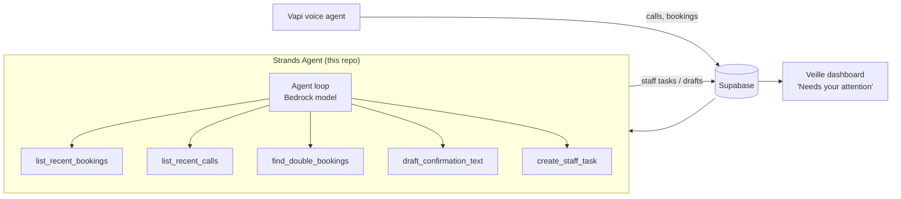

# Veille Back-office Concierge — a Strands Agent

An autonomous **AWS Strands Agents SDK** agent that takes the repetitive
back-office follow-up off a small business's plate. It works alongside
[Veille](https://app.veille.biz), an after-hours AI receptionist that answers
calls/texts and books appointments. Veille handles the *live* conversation; this
agent handles the *aftermath* — quietly, in the background — and only surfaces
the items a human must actually decide.

Built for the **Agents for Humans Hackathon — Professional Agents** track.

## What it does

Once per run (schedule it every morning), the agent:

1. Reviews the last 24h of **calls** and **bookings** from Veille's database.
2. **Drafts confirmation texts** for the clear, unambiguous bookings.
3. **Detects double-bookings** (overlapping 1-hour slots) and scheduling gaps.
4. Flags **ambiguous / unresolved** items (missing service or time, still-urgent
   escalations) as **staff tasks** — and *only* those. Routine bookings it can
   handle never generate a task.

The result: the owner opens the dashboard to a short "needs your attention" list
instead of scrolling every overnight call.

## Architecture



- **Model**: Amazon Bedrock (Amazon Nova Lite) via Strands' default provider.
- **Tools**: thin wrappers over Veille's Supabase REST API (read bookings/calls,
  write `agent_tasks`). No changes to the live voice pipeline.
- **Human-in-the-loop**: the agent drafts and flags; it never messages customers.

## Run it

```bash
python -m venv .venv && . .venv/Scripts/activate   # (Windows) or source .venv/bin/activate
pip install -r requirements.txt
cp .env.example .env    # fill in Supabase + AWS values
python agent.py
```

You need:
- A Supabase URL + **service-role** key, and the target business UUID.
- AWS credentials with **Amazon Bedrock** model access in your region
  (`aws configure`, or `AWS_ACCESS_KEY_ID` / `AWS_SECRET_ACCESS_KEY`).

Apply the `agent_tasks` table first (`migrations/0007_agent_tasks.sql`).

### Schedule it (optional)
Any scheduler works — cron, a GitHub Action on a schedule, or an AWS Lambda
triggered by EventBridge. The agent is a single `python agent.py` invocation.

## License

MIT — see [LICENSE](LICENSE).
